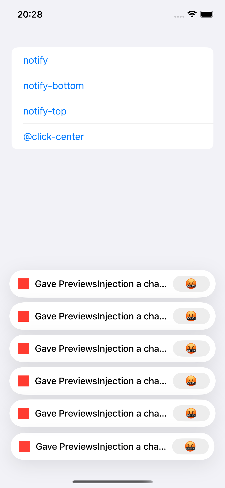

# swiftui-ext-toastify 🌟🌟🌟🌟🌟

> If you find this project helpful, please consider giving it a ⭐ on GitHub! Your support means a lot and helps the project grow. Thank you! 🌟

**swiftui-ext-toastify** is a SwiftUI extension for easily displaying toast notifications with customizable appearance, multiple toast types (success, error, warning, etc.), and simple integration. Built upon [swiftui-toasts](https://github.dev/sunghyun-k/swiftui-toasts).

---

## Features

- Show toast notifications in any SwiftUI view
- Support for various toast types: success, error, warning, custom, etc.
- Customizable icon, message, button, duration, and position (top or bottom)
- Simple, flexible API for integration

---

## Preview



---

## Usage

Import the package and use `EMethodsToastify.notify` to display toasts anywhere in your SwiftUI app. Below is an example `ContentView` with three buttons to trigger toasts in different positions.

```swift
import SwiftUI

#Preview { ContentView() }

struct ContentView: View {
    var body: some View {
        List {
            Button {
                EMethodsToastify
                    .notify(
                        value: .append(
                            .init(
                                icon: Color.red,
                                message: "Gave PreviewsInjection a chance to run and it returned, continuing with debug dylib",
                                button: .init(title: "🤬", action: { print("@give") }),
                                duration: TimeInterval(5)
                            )
                        )
                    )
            } label: {
                Text("notify")
            }
            
            Button {
                EMethodsToastify.notify(value: .position(position: .bottom))
                EMethodsToastify
                    .notify(
                        value: .append(
                            .init(
                                icon: Color.red,
                                message: "Gave PreviewsInjection a chance to run and it returned, continuing with debug dylib",
                                button: .init(title: "🤬", action: { print("@give") }),
                                duration: TimeInterval(5)
                            )
                        )
                    )
            } label: {
                Text("notify-bottom")
            }
            
            Button {
                EMethodsToastify.notify(value: .position(position: .top))
                EMethodsToastify
                    .notify(
                        value: .append(
                            .init(
                                icon: Color.red,
                                message: "Gave PreviewsInjection a chance to run and it returned, continuing with debug dylib",
                                button: .init(title: "🤬", action: { print("@give") }),
                                duration: TimeInterval(5)
                            )
                        )
                    )
            } label: {
                Text("notify-top")
            }
        }
        .frame(maxWidth: .infinity, maxHeight: .infinity)
    }
}
```

---

## Installation

Add **swiftui-ext-toastify** to your project using Swift Package Manager:

```
https://github.com/your-username/swiftui-ext-toastify
```

---

## Credits

- Based on [swiftui-toasts](https://github.dev/sunghyun-k/swiftui-toasts) by sunghyun-k

---

## License

MIT License. See [LICENSE](LICENSE) for details.
